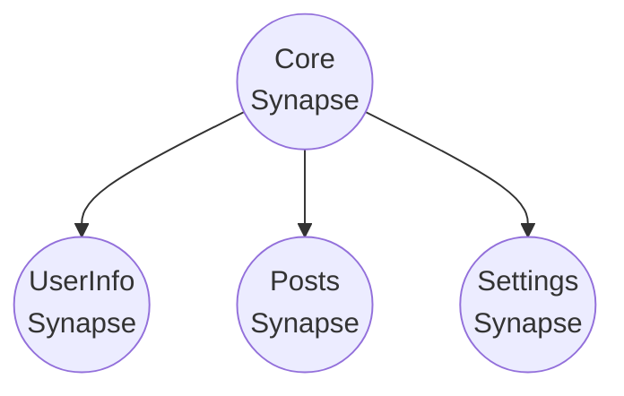
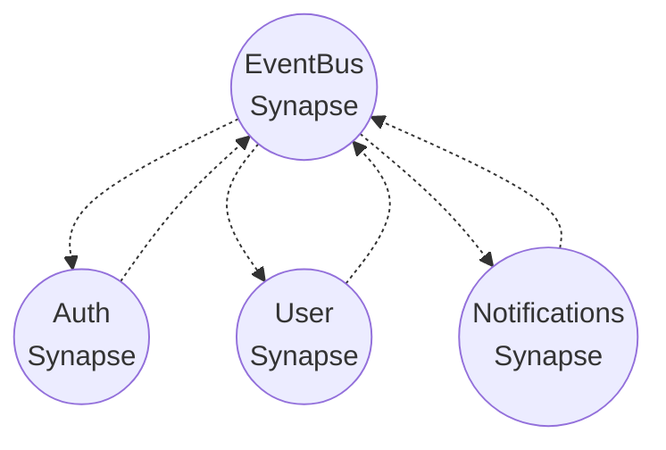

> [🏠 Home](./README.md)

# Code Organization Example and createSynapse Utility Usage

The createSynapse utility is just a wrapper over all modules that connects them into a single whole.
You can make your own if it's more convenient.

Suggested file structure

```md
📦some-directory
└── 📂synapses
│    └── 📂core
│    │    ├── 📄core.dispatcher.ts
│    │    ├── 📄core.synapse.ts
│    │    └── ...
│    └── 📂user-info
│    │    ├── 📄user-info.context.tsx
│    │    ├── 📄user-info.dispatcher.ts
│    │    ├── 📄user-info.effects.ts
│    │    ├── 📄user-info.selectors.ts
│    │    ├── 📄user-info.store.ts
│    │    └── 📄user-info.synapse.ts
│    └──...
│
└── 📄indexdb.config.ts
```

```typescript
// user-info.store.ts
// === CREATING STORAGE OF NEEDED TYPE ===
export async function createUserInfoStorage() {
  return new MemoryStorage<AboutUserUserInfo>({
    name: 'user-info',
    initialState: {
      userInfoInit: undefined,
      isChangeActive: false,
      fieldsInit: {},
      fields: {},
    },
  }).initialize()
}
```

```typescript
// user-info.dispatcher.ts
// === CREATING DISPATCHER ===

import { IStorage } from 'synapse-storage/core'
import { createDispatcher, loggerDispatcherMiddleware } from 'synapse-storage/reactive'

export function createUserInfoDispatcher(store: IStorage<AboutUserUserInfo>) {
  const loggerMiddleware = loggerDispatcherMiddleware({...})

  return createDispatcher({ storage: store }, (storage, { createAction, createWatcher }) => ({
    setCurrentUserProfile: createAction<UserProfileInfo, UserProfileInfo>({
      type: 'setCurrentUserProfile',
      // meta: ,
      // action: async () => {...}),
    }),

    setActiveChange: createAction<void, void>({
      type: 'setActiveChange',
      // meta: ,
      // action: async () => {...}),
    })
  // Other dispatchers ...
  })).use(loggerMiddleware)
}

export type UserInfoDispatcher = ReturnType<typeof createUserInfoDispatcher>
```

```typescript
// user-info.selectors.ts
// === CREATING SELECTORS ===
import { ISelectorModule } from 'synapse-storage/core'

export const createUserInfoSelectors = (selectorModule: ISelectorModule<AboutUserUserInfo>) => {
  const currentUserProfile = selectorModule.createSelector((s) => s.userInfoInit)
  const fieldsInit = selectorModule.createSelector((s) => s.fieldsInit)

  const isChangeActive = selectorModule.createSelector((s) => s.isChangeActive)

  const fields = selectorModule.createSelector((s) => s.fields)
  // For React
  // Component will re-render whenever the value returned by selector changes
  // To reduce re-renders, I recommend creating specific selectors
  // If you have a separate component for displaying information - better create a separate selector for it
  const fieldInformation = selectorModule.createSelector((s) => s.fields.information)
  const fieldPosition = selectorModule.createSelector((s) => s.fields.position)
  //...

  return ({
    currentUserProfile,
    isChangeActive,
    //...
  })
}
```

```typescript
// user-info.effects.ts
// === CREATING EFFECTS ===
import { EMPTY, from, of } from 'rxjs'
import { catchError, map } from 'rxjs/operators'
import { combineEffects, createEffect, ofType, validateMap } from 'synapse-storage/reactive'

type CurrentDispatchers = {
  userInfoDispatcher: UserInfoDispatcher
  coreIdbDispatcher: CoreDispatcher
};
type CurrentApis = {
  userInfoAPi: typeof userInfoEndpoints
};
type ExternalStorages = {
}

type Effect = ReturnType<typeof createEffect<
  AboutUserUserInfo,     // Current storage type
  CurrentDispatchers,       // Dispatcher types
  CurrentApis,              // API types
  Record<string, void>, // Configuration type
  ExternalStorages     // External storage stream types
>>

/**
 * Add received user profile to current store
 */
const loadUserInfoById: Effect = createEffect((action$, state$, { userInfoDispatcher, coreIdbDispatcher }) => action$.pipe(
  // Subscribe to changes in external Synapse
  ofType(coreIdbDispatcher.watchers.watchCurrentUserProfile),
  map((s) => {
    if (!s.payload) return EMPTY
    // Take data from external Synapse and put it in current one
    return userInfoDispatcher.dispatch.setCurrentUserProfile(s.payload)
  }),
))

const updateUserProfile: Effect = createEffect((action$, state$, { userInfoDispatcher }, { userInfoAPi }) => action$.pipe(
  ofType(userInfoDispatcher.dispatch.submit),
  validateMap({
    // Validation before request
    validator: (action) => ({
      skipAction: userInfoDispatcher.dispatch.reset(),
      conditions: [Boolean(action.payload)]
    }),
    apiCall: (action) => {
      return from(
        userInfoAPi.getUserById.request({ user_id: 1 }).waitWithCallbacks({
          // Called only when request is actually sent, not taken from cache
          loading: (request) => {
            // At this moment loading will be set and other necessary logic
            // userInfoDispatcher.dispatch.request(id)
          },
          // Can be used like this:
          success: (data, request) => {
            // userInfoDispatcher.dispatch.success({ data })
          },
          error: (error, request) => {
            // userInfoDispatcher.dispatch.failure(error!)
          },
        }),
      )
    },
  }),
))

export const userInfoEffects = combineEffects(
  loadUserInfoById,
  updateUserProfile,
)

```

```typescript
// user-info.synapse.ts
// === CREATING Synapse ===
import { createSynapse } from 'synapse-storage/utils'
import { createUserInfoDispatcher } from './user-info.dispatcher'
import { userInfoEffects } from './user-info.effects'
import { createUserInfoSelectors } from './user-info.selectors'
import { createUserInfoStorage } from './user-info.store'
import { userInfoEndpoints } from '../../api/user-info.api'
import { coreSynapseIDB } from '../core/core.synapse'

export const userInfoSynapse = await createSynapse({
  dependencies: [coreSynapseIDB], // Wait for coreSynapseIDB to initialize
  // Pass storage
  // This can be 
  // 1 - Function that returns ready storage
  createStorageFn: createUserInfoStorage,
  // 2 - Class for creating storage (initialize() will be called inside)
  // storage: new MemoryStorage<AboutUserUserInfo>({
  //   name: 'user-info',
  //   initialState: {
  //     userInfoInit: undefined,
  //     isChangeActive: false,
  //     fieldsInit: {},
  //     fields: {},
  //   },
  // }),
  // Dispatcher creation function (Optional)
  createDispatcherFn: createUserInfoDispatcher,
  // Selector creation function (Optional)
  createSelectorsFn: createUserInfoSelectors,
  // External selectors (Optional)
  externalSelectors: {
    // externalSelectors1: ...
  },
  // Configuration for effects (Optional)
  createEffectConfig: (userInfoDispatcher) => ({
    // Dispatchers for effects
    dispatchers: {
      userInfoDispatcher,                           // Current one, for managing own storage
      coreIdbDispatcher: coreSynapseIDB.dispatcher, // External one, for interaction with external storage
      //...
    },
    // Additional API at your discretion (for me these are API Clients)
    api: {
      userInfoAPi: userInfoEndpoints,
    },
    // External states as streams that we want to use in effects
    externalStates: {
      pokemonState$: pokemon1State$,
      core$: coreSynapseIDB.state$,
    },
  }),
  // Effects that will be started for this synapse
  effects: [userInfoEffects],
})
```

```tsx
// user-info.context.tsx
// === CREATING React Context ===
import { createSynapseCtx } from 'synapse-storage/react'
import { userInfoSynapse } from './user-info.synapse'

// Get all necessary tools for working in component
export const {
  contextSynapse: useUserInfoContextSynapse,
  useSynapseActions: useUserInfoSynapseActions,
  useSynapseSelectors: useUserInfoSynapseSelectors,
  useSynapseState$: useUserInfoSynapseState$,
  useSynapseStorage: useUserInfoSynapseStorage,
  cleanupSynapse: useUserInfoCleanupSynapse,
} = createSynapseCtx(
    // Pass Synapse itself
    userInfoSynapse,
    {
      loadingComponent: <div>loading</div>, // Pass component that will be displayed during initialization loading
      // mergeFn: // Function for merging passed parameters into initialState (deep copy is performed by default)
    },
)
```

This way you can separate functionality into layers

---
## Connecting Synapse to Each Other

### 📊 Regular Connection via Dependencies

As shown in the example above - you can connect synapses simply by passing them in the dependencies array
```typescript
// user-info.synapse.ts
// === CREATING Synapse ===
import { createSynapse } from 'synapse-storage/utils'
import { createUserInfoDispatcher } from './user-info.dispatcher'
import { userInfoEffects } from './user-info.effects'
import { createUserInfoSelectors } from './user-info.selectors'
import { createUserInfoStorage } from './user-info.store'
import { userInfoEndpoints } from '../../api/user-info.api'
import { coreSynapseIDB } from '../core/core.synapse'

export const currentSynapse = await createSynapse({
  dependencies: [someSynapse1, someSynapse2, someSynapse3], // Will wait for initialization of everything it depends on
  //...
})
```

In this case, the overall schema will look like this:


### 📡 EventBus Pattern (Advanced)

EventBus pattern is an alternative way to connect synapses to each other
Its main advantages are reducing coupling between modules and avoiding circular dependency problems when you need to connect two modules in both directions

In this case, the overall schema will look like this:



### ⚙️ EventBus Configuration

```typescript
const appEventBus = await createEventBus({
  name: 'app-events',        // Name for debugging and logging
  autoCleanup: true,         // Automatic cleanup of old events
  maxEvents: 500            // Maximum number of events in memory
})
```

#### 🔧 Main Methods

- publish() - publish event with data and metadata
- subscribe() - subscribe to events with pattern support ('USER_*', '*')
- getEventHistory() - get event history for specific event type
- clearEvents() - clear events (all or older than specific time)
- getActiveSubscriptions() - list of active subscriptions

#### 💡 Practical Tips

- Event naming: use 'MODULE_ACTION' format (e.g., 'USER_LOGGED_IN', 'ORDER_CREATED')
- Patterns: 'USER_*' for all user events, '*' for global monitoring
- Priorities: 'high' for critical events, 'normal' for regular, 'low' for logging

```typescript
// Creating EventBus using utility
import { createEventBus } from 'synapse-storage/utils'

export const appEventBus = await createEventBus({
  name: 'app-events',
  autoCleanup: true,
  maxEvents: 500
})

// auth.synapse.ts
export const authSynapse = await createSynapse({
  dependencies: [appEventBus], // Connect EventBus
  createEffectConfig: (authDispatcher) => ({
    dispatchers: {
      authDispatcher,
      eventBus: appEventBus.dispatcher
    }
  }),
  effects: [
    // Effect to publish events on successful authentication
    createEffect((action$, state$, _, { authDispatcher, eventBus }) => 
      action$.pipe(
        ofType(authDispatcher.dispatch.loginSuccess),
        map(action => 
          eventBus.dispatch.publish({
            event: 'USER_LOGGED_IN',
            data: action.payload,
            metadata: { priority: 'high' }
          })
        )
      )
    )
  ]
})

// user.synapse.ts
export const userSynapse = await createSynapse({
  dependencies: [appEventBus], // Connect EventBus
  createEffectConfig: (userDispatcher) => ({
    dispatchers: {
      userDispatcher,
      eventBus: appEventBus.dispatcher
    }
  }),
  effects: [
    // Effect to subscribe to auth events
    createEffect((action$, state$, _, { userDispatcher, eventBus }) => {
      // Subscribe to user login events
      eventBus.dispatch.subscribe({
        eventPattern: 'USER_*', // Pattern support
        handler: (userData, event) => {
          if (event.event === 'USER_LOGGED_IN') {
            userDispatcher.dispatch.loadUserProfile(userData.id)
          }
        },
        options: { priority: 'high' } // Priority filtering
      })
      
      return EMPTY // This effect only sets up subscription
    })
  ]
})

// notifications.synapse.ts
export const notificationsSynapse = await createSynapse({
  dependencies: [appEventBus],
  createEffectConfig: (notificationsDispatcher) => ({
    dispatchers: {
      notificationsDispatcher,
      eventBus: appEventBus.dispatcher
    }
  }),
  effects: [
    // Subscribe to all events to show notifications
    createEffect((action$, state$, _, { notificationsDispatcher, eventBus }) => {
      eventBus.dispatch.subscribe({
        eventPattern: '*', // Listen to all events
        handler: (data, event) => {
          notificationsDispatcher.dispatch.showNotification({
            message: `Event: ${event.event}`,
            data
          })
        }
      })
      
      return EMPTY
    })
  ]
})
```

### 🎯 Advantages of Each Approach

#### Dependencies (Regular)
- ✅ Easy to understand
- ✅ Direct connections between modules
- ✅ TypeScript typing out of the box
- ❌ Tight coupling between modules
- ❌ Complexity with large number of connections

#### EventBus (Advanced)
- ✅ Loose coupling between modules
- ✅ Easy to add new modules
- ✅ Centralized event management
- ✅ Ability to debug all events in one place
- ✅ Event pattern support ('USER_*', '*')
- ✅ Filtering by priority and metadata
- ✅ Automatic cleanup of old events
- ❌ Complexity in tracking data flow
- ❌ Need for manual event typing

## 📚 Navigation

- [🏠 Home](./README.md)
- [📖 All documentation sections](./README.md#-documentation)

### Related sections:
- [🚀 Basic Usage](./basic-usage.md)
- [⚡ Creating Dispatcher](./create-dispatcher.md)
- [⚡ Creating Effects](./create-effects.md)
- [🧮 Redux-style Computed Selectors](./redux-selectors.md)
- [🌐 API Client](./api-client.md)


