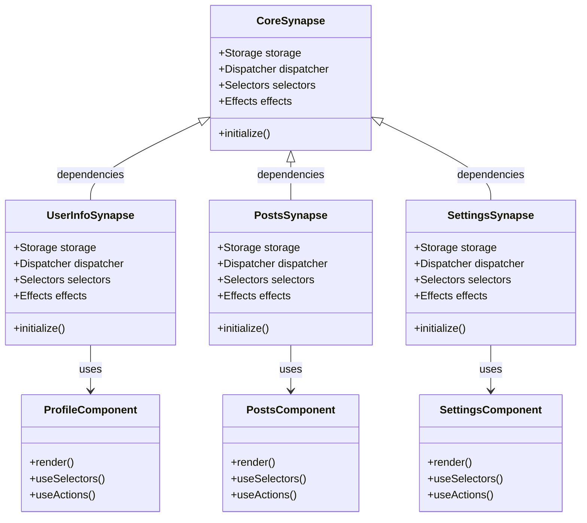
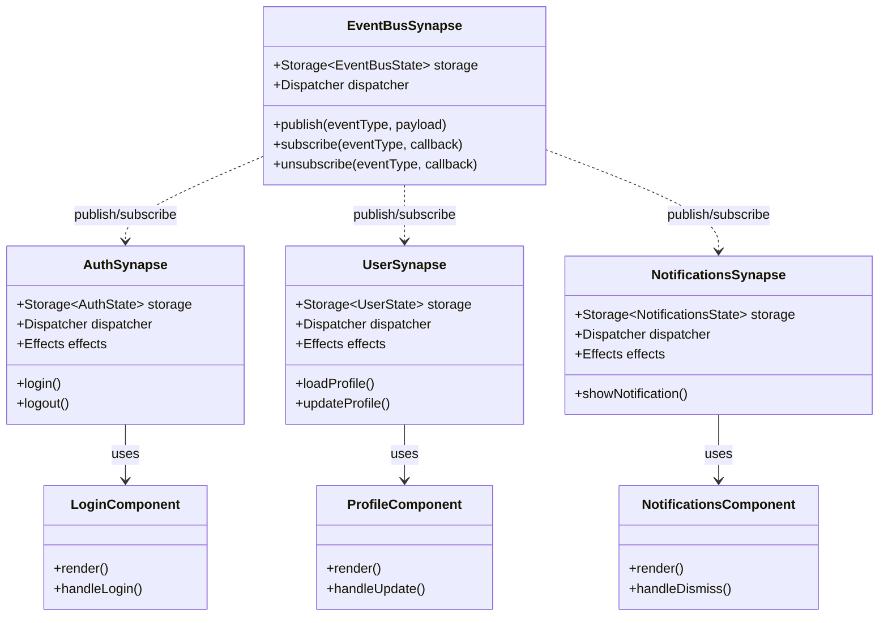

> [🏠 Главная](./README.md)
 
# Пример организации кода и использования утилиты createSynapse

Утилита createSynapse - это всего лишь обертка над всеми модулями, которая связывает их в единое целое.
Вы можете сделать свою, если так будет удобнее.

Предлагаемая структура файлов

```md
📦some-directory
└── 📂synapses
│    └── 📂core
│    │    ├── 📄core.dispatcher.ts
│    │    ├── 📄core.synapse.ts
│    │    └── ...
│    └── 📂user-info
│    │    ├── 📄user-info.context.tsx
│    │    ├── 📄user-info.dispatcher.ts
│    │    ├── 📄user-info.effects.ts
│    │    ├── 📄user-info.selectors.ts
│    │    ├── 📄user-info.store.ts
│    │    └── 📄user-info.synapse.ts
│    └──...
│
└── 📄indexdb.config.ts
```

```typescript
// user-info.store.ts
// === СОЗДАНИЕ ХРАНИЛИЩА НУЖНОГОТИПА ===
export async function createUserInfoStorage() {
  return new MemoryStorage<AboutUserUserInfo>({
    name: 'user-info',
    initialState: {
      userInfoInit: undefined,
      isChangeActive: false,
      fieldsInit: {},
      fields: {},
    },
  }).initialize()
}
```

```typescript
// user-info.dispatcher.ts
// === СОЗДАНИЕ ДИСПЕТЧЕРА ===

import { IStorage } from 'synapse-storage/core'
import { createDispatcher, loggerDispatcherMiddleware } from 'synapse-storage/reactive'

export function createUserInfoDispatcher(store: IStorage<AboutUserUserInfo>) {
  const loggerMiddleware = loggerDispatcherMiddleware({...})

  return createDispatcher({ storage: store }, (storage, { createAction, createWatcher }) => ({
    setCurrentUserProfile: createAction<UserProfileInfo, UserProfileInfo>({
      type: 'setCurrentUserProfile',
      // meta: ,
      // action: async () => {...}),
    }),

    setActiveChange: createAction<void, void>({
      type: 'setActiveChange',
      // meta: ,
      // action: async () => {...}),
    })
  // Другие диспетчеры ...
  })).use(loggerMiddleware)
}

export type UserInfoDispatcher = ReturnType<typeof createUserInfoDispatcher>
```

```typescript
// user-info.dispatcher.ts
// === СОЗДАНИЕ СЕЛЕКТОРОВ ===
import { ISelectorModule } from 'synapse-storage/core'

export const createUserInfoSelectors = (selectorModule: ISelectorModule<AboutUserUserInfo>) => {
  const currentUserProfile = selectorModule.createSelector((s) => s.userInfoInit)
  const fieldsInit = selectorModule.createSelector((s) => s.fieldsInit)

  const isChangeActive = selectorModule.createSelector((s) => s.isChangeActive)

  const fields = selectorModule.createSelector((s) => s.fields)
  // Для React
  // Комопнент будет ререндериться всегда, когда меняется возвращаемое селектором значение
  // Для уменьшения ререндеров советую создавать точечные селекторы
  // Если для отображения information у вас отдельный компонент - лучше создать отдельный для него селектор
  const fieldInformation = selectorModule.createSelector((s) => s.fields.information)
  const fieldPosition = selectorModule.createSelector((s) => s.fields.position)
  //...

  return ({
    currentUserProfile,
    isChangeActive,
    //...
  })
}
```

```typescript
// user-info.effects.ts
// === СОЗДАНИЕ ЭФФЕКТОВ ===
import { EMPTY, from, of } from 'rxjs'
import { catchError, map } from 'rxjs/operators'
import { combineEffects, createEffect, ofType, validateMap } from 'synapse-storage/reactive'

type CurrentDispatchers = {
  userInfoDispatcher: UserInfoDispatcher
  coreIdbDispatcher: CoreDispatcher
};
type CurrentApis = {
  userInfoAPi: typeof userInfoEndpoints
};
type ExternalStorages = {
}

type Effect = ReturnType<typeof createEffect<
  AboutUserUserInfo,     // Тип текущего хранилища
  CurrentDispatchers,       // Типы диспетчеров
  CurrentApis,              // Типы api
  Record<string, void>, // Тип конфигурации
  ExternalStorages     // Типы внешних хранилищ потоков
>>

/**
 * Добавляем полученный профиль пользователя в текущий СТор
 */
const loadUserInfoById: Effect = createEffect((action$, state$, { userInfoDispatcher, coreIdbDispatcher }) => action$.pipe(
  // Подписываемся на изменения в стороннем Synapse
  ofType(coreIdbDispatcher.watchers.watchCurrentUserProfile),
  map((s) => {
    if (!s.payload) return EMPTY
    // Берем данные из стороннего Synapse и кладем в текущий
    return userInfoDispatcher.dispatch.setCurrentUserProfile(s.payload)
  }),
))

const updateUserProfile: Effect = createEffect((action$, state$, { userInfoDispatcher }, { userInfoAPi }) => action$.pipe(
  ofType(userInfoDispatcher.dispatch.submit),
  validateMap({
    // Валидация перед запросом
    validator: (action) => ({
      skipAction: userInfoDispatcher.dispatch.reset(),
      conditions: [Boolean(action.payload)]
    }),
    apiCall: (action) => {
      return from(
        userInfoAPi.getUserById.request({ user_id: 1 }).waitWithCallbacks({
          // Вызывается только тогда, когда запрос реально отправляется, а не берется из кэша
          loading: (request) => {
            // Именно в в этот момент установится loading и другая необходимая логика
            // userInfoDispatcher.dispatch.request(id)
          },
          // Можно использовать так:
          success: (data, request) => {
            // userInfoDispatcher.dispatch.success({ data })
          },
          error: (error, request) => {
            // userInfoDispatcher.dispatch.failure(error!)
          },
        }),
      )
    },
  }),
))

export const userInfoEffects = combineEffects(
  loadUserInfoById,
  updateUserProfile,
)

```

```typescript
// user-info.synapse.ts
// === СОЗДАНИЕ Synapse ===
import { createSynapse } from 'synapse-storage/utils'
import { createUserInfoDispatcher } from './user-info.dispatcher'
import { userInfoEffects } from './user-info.effects'
import { createUserInfoSelectors } from './user-info.selectors'
import { createUserInfoStorage } from './user-info.store'
import { userInfoEndpoints } from '../../api/user-info.api'
import { coreSynapseIDB } from '../core/core.synapse'

export const userInfoSynapse = await createSynapse({
  dependencies: [coreSynapseIDB], // Дождется инициализации coreSynapseIDB
  // Передаем хранилище
  // Это может быть 
  // 1 - Функция, которая фозвращает готовое ранилище
  createStorageFn: createUserInfoStorage,
  // 2 - Класс для создания хранилища (initialize() убдет вызван внутри)
  // storage: new MemoryStorage<AboutUserUserInfo>({
  //   name: 'user-info',
  //   initialState: {
  //     userInfoInit: undefined,
  //     isChangeActive: false,
  //     fieldsInit: {},
  //     fields: {},
  //   },
  // }),
  // Функция создания диспетчеров (Опционально)
  createDispatcherFn: createUserInfoDispatcher,
  // Функция создания селекторов (Опционально)
  createSelectorsFn: createUserInfoSelectors,
  // Внешние селекторы (Опционально)
  externalSelectors: {
    // externalSelectors1: ...
  },
  // Конфигурация для эффектов (Опционально)
  createEffectConfig: (userInfoDispatcher) => ({
    // Диспетчеры для эффектов
    dispatchers: {
      userInfoDispatcher,                           // Текущий, для управления соственных хранилищем
      coreIdbDispatcher: coreSynapseIDB.dispatcher, // Внешний, для взаиможействия с внешними хранилищами
      //...
    },
    // Дополнительное АПИ по вашему усмотрения (у меня это API Clients)
    api: {
      userInfoAPi: userInfoEndpoints,
    },
    // Внешние состояния ввиде потоков, которые хотим использовать в эффектах
    externalStates: {
      pokemonState$: pokemon1State$,
      core$: coreSynapseIDB.state$,
    },
  }),
  // Эффекты которые будут запущены для этого synapse
  effects: [userInfoEffects],
})
```

```tsx
// user-info.context.tsx
// === СОЗДАНИЕ React Context ===
import { createSynapseCtx } from 'synapse-storage/react'
import { userInfoSynapse } from './user-info.synapse'

// Получаем все необходимые инструменты для работы в компонете
export const {
  contextSynapse: useUserInfoContextSynapse,
  useSynapseActions: useUserInfoSynapseActions,
  useSynapseSelectors: useUserInfoSynapseSelectors,
  useSynapseState$: useUserInfoSynapseState$,
  useSynapseStorage: useUserInfoSynapseStorage,
  cleanupSynapse: useUserInfoCleanupSynapse,
} = createSynapseCtx(
    // Передаем сам Synapse
    userInfoSynapse,
    {
      loadingComponent: <div>loading</div>, // Передаем компонент, который будет отображаться пока идет загрузка инициализация
      // mergeFn: // Функция слияния переданных параметров в initialState (по умолчанию выполняется глубокая копия)
    },
)
```

Таким образом вы можете резделить функционал на слои

---

## Связывание Synapse между собой

### 📊 Обычная связь через dependencies

Как показано на примере выше - вы можете связывать синопсы просто передавая их в массив зависимостей
```typescript
// user-info.synapse.ts
// === СОЗДАНИЕ Synapse ===
import { createSynapse } from 'synapse-storage/utils'
import { createUserInfoDispatcher } from './user-info.dispatcher'
import { userInfoEffects } from './user-info.effects'
import { createUserInfoSelectors } from './user-info.selectors'
import { createUserInfoStorage } from './user-info.store'
import { userInfoEndpoints } from '../../api/user-info.api'
import { coreSynapseIDB } from '../core/core.synapse'

export const currentSynapse = await createSynapse({
  dependencies: [someSynapse1, someSynapse2, someSynapse3], // Дождется инициализации всего, отчего зависит
  //...
})
```

В этом случае общая схема будет выглядеть так:


## 📡 EventBus паттерн (продвинутый)

EventBus паттерн - альтернативный способ связи синопсов между собой
Его главные преимущество - уменьшение связи между модулями и отсутствие проблемы циклических зависимостей, если нужно связать два модуля между собой в обоих направлениях 

В этом случае общая схема будет выглядеть так:


## 📋 Код EventBus паттерна

```typescript
// event-bus.synapse.ts
interface EventBusState {
  events: Record<string, any[]>
  subscribers: Record<string, Function[]>
}

export const eventBusSynapse = await createSynapse({
  createStorageFn: () => new MemoryStorage<EventBusState>({
    name: 'event-bus',
    initialState: {
      events: {},
      subscribers: {}
    }
  }).initialize(),
  
  createDispatcherFn: (store) => createDispatcher({ storage: store }, 
    (storage, { createAction }) => ({
      publish: createAction<{eventType: string, payload: any}>({
        type: 'publish',
        action: async (payload) => {
          // Уведомляем всех подписчиков
          const subscribers = storage.getValue().subscribers[payload.eventType] || []
          subscribers.forEach(callback => callback(payload.payload))
        }
      }),
      
      subscribe: createAction<{eventType: string, callback: Function}>({
        type: 'subscribe',
        action: async (payload) => {
          const current = storage.getValue()
          const subscribers = current.subscribers[payload.eventType] || []
          subscribers.push(payload.callback)
          
          storage.setValue({
            ...current,
            subscribers: {
              ...current.subscribers,
              [payload.eventType]: subscribers
            }
          })
        }
      })
    })
  )
})

// auth.synapse.ts
export const authSynapse = await createSynapse({
  // ... обычная конфигурация
  createEffectConfig: (authDispatcher) => ({
    dispatchers: {
      authDispatcher,
      eventBusDispatcher: eventBusSynapse.dispatcher
    }
  }),
  effects: [
    // Effect для публикации событий
    createEffect((action$, state$, { authDispatcher, eventBusDispatcher }) => 
      action$.pipe(
        ofType(authDispatcher.dispatch.loginSuccess),
        map(action => 
          eventBusDispatcher.dispatch.publish({
            eventType: 'USER_LOGGED_IN',
            payload: action.payload
          })
        )
      )
    )
  ]
})

// user.synapse.ts
export const userSynapse = await createSynapse({
  dependencies: [eventBusSynapse], // Подключаем EventBus
  // ... остальная конфигурация
  effects: [
    // Effect для подписки на события
    createEffect((action$, state$, { userDispatcher }) => {
      // Подписываемся на событие входа пользователя
      eventBusSynapse.dispatcher.dispatch.subscribe({
        eventType: 'USER_LOGGED_IN',
        callback: (userData) => {
          userDispatcher.dispatch.loadUserProfile(userData.id)
        }
      })
      
      return EMPTY // Этот effect только устанавливает подписку
    })
  ]
})
```

## 🎯 Преимущества каждого подхода

### Dependencies (Обычный)
- ✅ Простота понимания
- ✅ Прямые связи между модулями
- ✅ TypeScript типизация из коробки
- ❌ Жесткая связанность модулей
- ❌ Сложность при большом количестве связей

### EventBus (Продвинутый)
- ✅ Слабая связанность модулей
- ✅ Легкость добавления новых модулей
- ✅ Централизованное управление событиями
- ✅ Возможность отладки всех событий в одном месте
- ❌ Сложность отслеживания потока данных
- ❌ Необходимость ручной типизации событий
___

## 📚 Навигация

- [🏠 Главная](./README.md)
- [📖 Все разделы документации](./README.md#-документация)

### Связанные разделы:
- [🚀 Базовое использование](./basic-usage.md)
- [⚡ Создание Диспетчера](./create-dispatcher.md)
- [⚡ Создание Эффектов](./create-effects.md)
- [🧮 Вычисляемые селекторы в стиле Redux](./redux-selectors.md)
- [🌐 API-клиент](./api-client.md)
